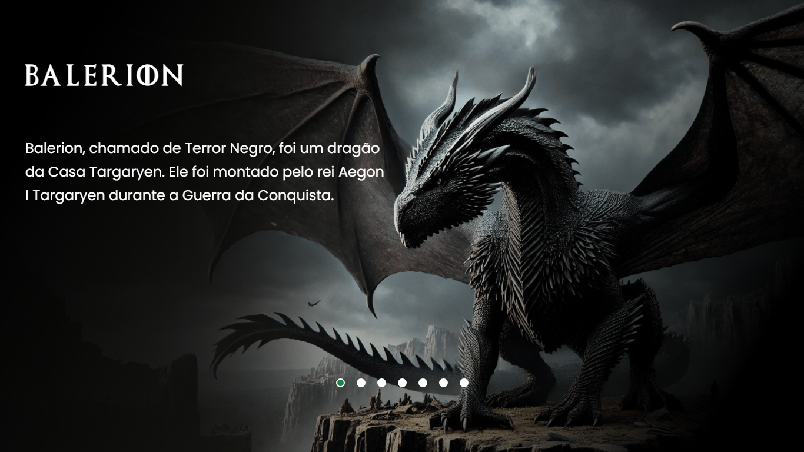

# **Mergulhe no Mundo de Game of Thrones com o nosso Carrossel de Dragões!** 

## **O que é esse projeto?** 

Já imaginou dar um passeio pelos céus de Westeros e conhecer de perto os dragões mais famosos de Game of Thrones? Com nosso carrossel mágico, você pode fazer isso! 

Essa aplicação te leva em uma jornada pelos dragões mais incríveis da série, como Balerion, Syrax e Vhagar. Clique em cada dragão e descubra curiosidades sobre sua história e características.

## **Como funciona?**

1. **Explore os dragões:** Clique nos botões para navegar entre os dragões e suas respectivas imagens.
2. **Descubra fatos incríveis:** Leia sobre a história de cada dragão e sua importância na série.
3. **Visual incrível:** As imagens dos dragões são de alta qualidade e a animação do carrossel te coloca no meio da ação.

## **Tecnologias utilizadas:**

* **HTML:** A base de tudo! Cria a estrutura da página.
* **CSS:** Deixa tudo bonitinho e responsivo, adaptando-se a qualquer tela.
* **JavaScript:** Adiciona a interatividade, fazendo o carrossel funcionar e mostrando as informações corretas.
* **Fontes personalizadas:** Usamos uma fonte inspirada em Game of Thrones para dar um toque especial ao projeto.

## **Como contribuir:**

Quer ajudar a melhorar esse projeto? Seja muito bem-vindo! Você pode:

* **Corrigir bugs:** Achou algum erro? Abra um issue no GitHub para reportar.
* **Adicionar novos dragões:** Se souber de algum dragão que não está na lista, faça um pull request com as informações.
* **Melhorar o design:** Tem ideias para deixar o projeto ainda mais bonito? Compartilhe!

## **Divirta-se!**

Esperamos que você se divirta explorando o mundo dos dragões com a gente! 
